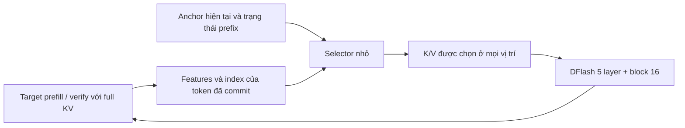

# Đề xuất module học chọn context cho DFlash trên ngữ cảnh dài

**Cập nhật hướng nghiên cứu:** đề xuất scorer học riêng trong file này được giữ để truy vết. Hướng ưu tiên sau làm rõ của người nghiên cứu là [cơ chế điều phối context tận dụng DFlash đã train](2026-10-06_dflash_context_execution_mechanism.md), dùng attention của chính drafter và quản lý working set trong inference.

Ngày: **2026-10-06**. Trạng thái: **đề xuất nghiên cứu**, chưa triển khai module, train hoặc chạy can thiệp cache. Cơ sở số liệu: [hồ sơ phân tích DFlash](2026-10-06_dflash_context_memory_paper_analysis.md), cùng các khảo sát được dẫn trong hồ sơ đó.

## 1. Đề xuất chính

**Giữ backbone DFlash năm layer; học một selector nhỏ, dựa trên trạng thái của lượt draft, để chọn các token context rải rác. Luôn giữ đủ 16 vị trí của block hiện tại và giữ full context/KV của target verifier.**

Context được chọn gồm **prompt và output đã commit**. Mục tiêu ban đầu là giảm số context K/V mà attention của drafter phải đọc, trong khi giữ số token thực tế commit mỗi round. Giảm dung lượng cache lưu trú là mục tiêu hệ thống riêng, cần tính cả ngân hàng features phục vụ tái chọn.

Câu hỏi nghiên cứu: *Một module nhỏ có thể dự đoán tập context cần cho lượt DFlash tiếp theo từ target-derived features và anchor hiện tại, tốt hơn quy tắc vị trí, với chi phí đủ thấp để giảm cost/token không?*

Đây là thiết kế module cho DFlash đã có; không có ước lượng thời gian training được xác nhận cho module này.

## 2. Từ insight tới quyết định thiết kế

| Insight đã đo | Quyết định đề xuất | Điều còn phải kiểm tra |
|---|---|---|
| Block 16 nhận mean khoảng 21–23% tổng attention | Giữ nguyên 1 anchor + 15 mask/proposal positions, ngoài budget cache | Attention block sẽ đổi khi context bị nén; không ép mass luôn bằng 20% |
| Vùng đầu và cuối thường có mass cao; tại 16K, 10% đầu + 10% cuối cache nhận 47,16% cache mass | Cho selector biết vị trí, loại prompt/output và khoảng cách tới block; khảo sát thêm một nhóm bảo vệ nhỏ ở đầu/cuối | Không suy từ mass rằng mọi token đầu/cuối đều cần thiết; cần ablation nhóm bảo vệ |
| Top-K rải rác bao phủ tốt hơn cửa sổ liên tiếp | Cho phép chọn token ở mọi vị trí, giữ absolute position của từng key | Coverage cao hơn có giữ logits và acceptance không? |
| Ở 16K, Top-4K cache + block giữ 82,66% tổng mass gốc | Thử nhiều budget; nếu selection-only mất chất lượng ngay cả với oracle, khảo sát memory tổng hợp cho phần còn lại | Không mặc định phần 17,34% còn lại là vô ích hoặc bắt buộc phải nén thành slot |
| Output đã commit nhận khoảng 20–27% tổng mass | Prompt và output cùng tham gia tập ứng viên; cập nhật khi target commit token | Không đặt quota prompt/output cố định cho mọi lượt |
| Top-1K cache trùng 82,65% giữa hai lượt gần nhau, nhưng 31,11% giữa lượt giữa–cuối | Tái sử dụng K/V của token được chọn ở cả hai lượt; vẫn cập nhật lựa chọn theo trạng thái | Chưa chốt chu kỳ refresh từ overlap trung bình |
| Năm draft layer có nhu cầu khác nhau | V1 dùng tập chung để triển khai đơn giản, nhưng theo dõi fidelity từng layer | Chỉ thêm routing theo layer nếu lợi ích đủ bù chi phí |
| Parent target attention chưa đủ cơ sở cho selector trực tiếp | Dùng DFlash dense làm teacher; dùng target hidden features làm input | Kết quả này không bác bỏ target features; literal bonus-to-next-draft chưa có sample |

Thiên lệch đầu/cuối là mô tả phân phối hiện có. Vùng đầu có thể liên quan attention sink, vùng cuối có thể liên quan recency hoặc output. Chưa có can thiệp phân biệt các cơ chế này.

## 3. Ba hướng và thứ tự ưu tiên

| Hướng | Lợi thế | Hạn chế | Vai trò |
|---|---|---|---|
| Quy tắc đầu/cuối và tái sử dụng tập cũ | Ít chi phí phát triển, không train | Bỏ qua key rải rác; có drift theo lượt | Baseline cần so sánh |
| **Selector nhỏ học theo trạng thái** | Giữ raw K/V và vị trí gốc; có thể train bằng nhãn attention offline, không backward qua DFlash | Bị giới hạn bởi chất lượng của selection-only; vẫn cần đọc index trên toàn cache | **Phiên bản đầu được đề xuất** |
| Selector + learned memory cho phần không chọn | Có cơ chế mang thông tin từ phần context trải rộng | Phức tạp hơn về training, vị trí và cập nhật; học memory cần distillation qua backbone | Nhánh tiếp theo nếu can thiệp oracle chỉ ra nhu cầu |

Không xây cả ba thành phần học ngay từ đầu. Cần biết selection raw key có đủ headroom chất lượng trước khi đầu tư vào compressor.

## 4. Module V1: selector học được

### 4.1. Dữ liệu vào, có sẵn trước lượt draft

Gọi `C_t` là các vị trí prompt + output đã commit trước lượt `t`; `B_t` là block hiện tại gồm 16 vị trí. Với token cache `i`, dùng:

- `h_i`: target-derived feature sau phép `fc` và normalization hiện có của DFlash.
- Token position, thuộc prompt hay output, khoảng cách tới block và độ dài context.

Trạng thái `z_t` để điều kiện hóa lựa chọn gồm embedding của **anchor hiện tại**, pooled features của một số token cache gần nhất và độ dài prompt/output. Anchor token đã được target sinh trước lượt draft; hidden feature của chính anchor có thể chưa có, nên không yêu cầu nó làm input.

Nguồn features dùng đúng pipeline [DFlash trong repository](../../externals/dflash/dflash/model.py): các target hidden states được nối và chiếu, rồi mỗi draft layer tự tạo K/V. Kiến trúc conditioning này cũng được mô tả trong [bài DFlash](https://arxiv.org/abs/2602.06036).

Không dùng current DFlash attention, current verifier attention hoặc target hidden states của proposal chưa verify làm input online. Các giá trị đó chỉ được dùng làm teacher/nhãn offline khi phù hợp.

### 4.2. Một scorer đơn giản

Chiếu mỗi `h_i` xuống một index vector nhỏ `r_i`, tính một lần khi token được thêm vào cache. Từ `z_t`, tạo query của selector `u_t`. Một cấu hình pilot có thể dùng index dimension 128:

```text
r_i    = W_key h_i
u_t    = MLP(z_t)
s_t(i) = dot(u_t, r_i) / sqrt(d_index)
         + g(position_features(i, t), prompt_or_output(i))
```

Đây là score của module dự đoán, không phải attention Q/K thật của DFlash. Nó được học để xếp hạng context theo nhu cầu của drafter. Dimension 128 và pooling 16 token cache gần nhất là giá trị khởi đầu cho pilot, chưa có kết quả tuning.

Chọn `S_t = TopK(s_t)` trên toàn `C_t`. DFlash nhận K/V của `S_t` và đầy đủ `B_t`; token được chọn không cần liên tiếp. Sắp key theo absolute position để metadata và thực thi nhất quán.

Khảo sát một variant có nhóm bảo vệ `G_t` ở đầu/cache gần:

```text
S_t = G_t ∪ Top(K - |G_t|, C_t \ G_t)
```

Có thể bắt đầu với 64 token đầu + 128 token cuối cache, sau khi loại trùng và giới hạn theo `N_t`. Đây là **hyperparameter đề xuất**, không phải số token sink đã được xác định từ histogram 1K. Nhóm này nằm trong budget `K`, không được cộng ngoài budget. So sánh có/không bảo vệ ở cùng `K` để quyết định giữ nó.

### 4.3. Nhãn và cách học tiết kiệm

Với DFlash dense, lấy phân phối post-softmax trên đầy đủ `C_t ∪ B_t`, mean qua heads, 15 proposal queries và năm layer như collector hiện tại. Nhãn cho selector là phần cache của vector đó, được chuẩn hóa **sau khi mean layer**:

```text
p_t(i) = mean_{layer, head, proposal_query} attention_dense(i)
q_t(i) = p_t(i) / sum_{j ∈ C_t} p_t(j),  i ∈ C_t
L_select = - sum_{i ∈ C_t} q_t(i) log softmax(s_t)(i)
```

Block bị loại khỏi miền xếp hạng vì luôn được giữ. Mọi coverage chính vẫn báo trên **100% mass gốc**, gồm block; không đổi mẫu số của kết luận sang riêng prompt.

V1 freeze target và DFlash, cache input features rồi chỉ tối ưu scorer. Gradient của loss này không đi qua DFlash; nhãn attention không yêu cầu differentiable hard Top-K. Chất lượng drafting được đánh giá bằng forward can thiệp riêng.

Các NPZ đã lưu chứa attention vectors, chưa đủ để train scorer với các input trên. Cần bổ sung feature/state đã căn chỉnh theo trajectory; có thể dùng lại nhãn hiện có nếu căn chỉnh đúng token, vị trí và anchor. Chi phí tạo features và nhãn cần ghi riêng với chi phí optimizer.

Mean attention là nhãn khởi đầu thuận tiện, không phải ground truth về thông tin hữu ích. Nếu predictor đạt coverage tốt nhưng acceptance thấp, cần chuyển supervision sang fidelity của attention output/logits hoặc học memory; không chỉ tăng độ chính xác xếp hạng nhãn cũ.

### 4.4. Cập nhật giữa các lượt

1. Prefill target bằng full prompt; tạo ngân hàng features/index và anchor đầu tiên.
2. Score và chọn `S_t` từ toàn bộ cache đã commit.
3. Gather K/V đã chọn, thực hiện một lượt DFlash với block 16 nguyên vẹn.
4. Verify bằng target với full KV và semantics acceptance/stop gốc.
5. Chỉ thêm features/index của token **thực sự commit**, xử lý EOS đúng; bỏ K/V tạm của block.
6. Ở lượt tiếp, tái sử dụng K/V của giao `S_t ∩ S_{t+1}`; tạo/gather phần mới.

V1 rescore index mỗi lượt để tránh khóa sai lịch refresh. Sau khi profile mới so refresh mỗi 2/4 lượt với rescore mỗi lượt; đầu ra mới phải được xét và có cơ chế quay lại score toàn cache. Không suy “trùng khoảng 83%” thành quy tắc luôn giữ 83% tập cũ.

Trong implementation nén, logical token position phải tách khỏi physical cache length. Không dùng số key đang lưu để suy absolute position, và không dùng nguyên `crop(start)` với `start` là độ dài lịch sử đầy đủ để rollback compact cache. Metadata theo token ID/vị trí phải xác định rõ committed keys và temporary block keys.



## 5. Budget và phép đo trên toàn context

Budget phương pháp là **`K` cache key + 16 block key**. V1 khảo sát `K = 1.024 / 4.096 / 8.192`; ở context ngắn, chỉ chọn tối đa số cache key thực có. `K ≥ N_t` giữ toàn cache và không tạo nén ở lượt đó.

Mốc tham khảo tại 16K từ khảo sát đã có:

| Lựa chọn oracle trên cache | Coverage cache | Coverage tổng gốc, luôn giữ block |
|---|---:|---:|
| Top-1K | 58,58% | 67,43% |
| Top-4K | 77,96% | 82,66% |
| Top-8K | 89,99% | 92,12% |

Đây là coverage của **attention dense đã đo**, không phải attention sau nén hoặc acceptance sau bỏ key. Selector thực tế và variant có guard không được giả định sẽ đạt các con số oracle này. Oracle là upper bound coverage với tập chung/budget đã định nghĩa, không phải upper bound chất lượng drafting: token ít mass vẫn có thể tác động logits.

Khởi đầu kiểm tra 4K tại 16K. Curve acceptance/cost ở các budget sẽ quyết định có cần budget thích ứng theo độ dài hoặc trạng thái không; không đặt mục tiêu cứng rằng 1K phải đủ ở mọi context.

### 5.1. Vì sao giữ block không đồng nghĩa giữ 20% attention?

Nếu chỉ xóa key trong một head/query và giữ Q/K của các key còn lại, softmax sẽ chuẩn hóa lại. Với `b` là block mass gốc và `R` là tổng mass gốc của tập được giữ:

```text
block_mass_after_pruning = b / R
```

Ví dụ minh họa: `b=20%`, `R=70%` thì block nhận khoảng 28,6% sau pruning ở head/query đó. Trong DFlash nhiều layer, Q của layer sau còn đổi nên tác động có thể khác. Không dùng tỷ số các mean đã aggregate để dự báo chính xác attention sau nén.

Vì vậy cần theo dõi attention output/logits và accepted prefix, thay vì đặt loss yêu cầu block luôn nhận 20%. Sink hoặc key xa còn có thể ảnh hưởng cả normalization lẫn value aggregation; chỉ nhìn mass không tách được hai vai trò này.

## 6. Nhánh memory tổng hợp, nếu selection-only chưa đủ

Nếu oracle Top-K can thiệp cũng giảm acceptance đáng kể ở budget hữu ích, thử **giữ một phần raw key để bảo toàn chi tiết + học một số memory slot cho phần context không được chọn**.

Để so công bằng, với budget tổng context memory `K`, hybrid giữ `K-M` raw key và `M` slot, vẫn cộng 16 block. So với selection-only `K` raw key trên cùng budget và cùng backbone. Không thêm slot ngoài budget rồi quy mọi gain cho synthesis.

Memory slots phải học giữ đầu ra attention hoặc dense-draft logits, không chỉ mean-pool features theo vị trí. Chúng không tự động tái tạo tổng softmax contribution của nhiều token bị gộp. Scheme vị trí, tổng multiplicity/mass của nhóm, cập nhật khi output commit và tránh đếm trùng phần raw được chọn đều cần thiết kế riêng và ablation.

Học slots bằng distillation qua DFlash frozen có thể cần backward qua backbone. Freeze trọng số giảm optimizer state, không bảo đảm training rẻ tương ứng số tham số trainable. Nhánh này chỉ nên mở sau khi can thiệp xác định selection-only có giới hạn phù hợp.

## 7. Lộ trình thực nghiệm nhỏ để quyết định

Các mục dưới đây là **kế hoạch**, chưa chạy trong lần đề xuất.

### A. Kiểm tra chất lượng khi chọn cache trước khi train

- Bắt đầu với 3 instance dài thuộc cohort dev đã khảo sát, tại 16K; lấy lượt đầu/giữa/cuối, tổng 9 trạng thái prefix/anchor cố định.
- Budget đầu tiên 4K cache + block 16. So dense, oracle Top-K DFlash hiện tại, đầu+cuối cùng budget và random. Nếu cần định vị giới hạn, mở thêm 1K/8K.
- Đo logit agreement/KL trên cùng trạng thái và accepted prefix với full target verification. Chỉ đếm token thực tế commit tới EOS; không đếm raw acceptance qua stop.
- Nếu oracle vẫn mất nhiều acceptance, xác định bằng curve budget và diagnostic theo layer/query; không coi học ranking tốt hơn oracle attention là mục tiêu mặc định.

### B. Pilot scorer nhỏ

- Dùng cohort 10 document hiện có làm **dev**; có thể chia 8 train/2 validation cho pilot, nhưng cả 10 đã tham gia thiết kế nên không gọi 2 document này là untouched holdout.
- Lấy nhãn ở các lượt đầu/giữa/cuối và một số cặp liền kề; bổ sung features/state đúng input. Freeze backbone, train scorer bằng `L_select`.
- So learned selection với các heuristic ở cùng prefix, budget và guard policy. Báo coverage tổng/cache, fidelity từng layer và accepted prefix, không chỉ loss train.
- Nếu có tín hiệu, chạy rollout ngắn. Trajectory do module tạo có thể khác teacher; khảo sát lỗi trên các trạng thái mới trước khi tăng quy mô.
- Chỉ sau đó khóa lựa chọn trên dev và đánh giá document mới, trước mắt cùng GovReport rồi mở domain khác nếu cần claim generalization.

### C. Chi phí thực thi

V1 có thể giữ ngân hàng full draft K/V để tái chọn, nhưng forward attention chỉ đọc K/V đã gather. Thiết kế này kiểm tra savings về lượng đọc/compute; **chưa giảm resident full KV**, còn có thêm index và gather buffers.

Variant giảm storage có thể giữ `h_i` chung và index cho mọi token, chỉ lưu K/V cho tập chọn; token được chọn lại sẽ cần chiếu K/V của các layer. Cần so bytes của feature bank, index, compact K/V và buffer với full draft KV trên config thật. Target full KV vẫn tồn tại ở cả hai phương pháp.

Primary metric là **cost/token của rollout**, đi cùng mean và phân bố số token thực tế commit mỗi round. Đo riêng selector/index build, Top-K, gather/reprojection, draft, verify, prefill và tổng peak VRAM. Với cùng cohort và weighting:

```text
cost/token = total decoding time / total committed output tokens
T_round   = T_select/update/gather + T_draft + T_verify + T_other
```

Giảm `T_draft` nhưng giảm acceptance có thể tăng tổng thời gian. Cần profile tỷ lệ draft/verify trước khi đầu tư kernel; không dùng timing collector eager làm latency baseline. Giữ backend, hardware và target verifier có cache công bằng; kiểm tra output greedy với target full-context và ROUGE khi có reference.

## 8. Đóng góp paper dự kiến và ranh giới claim

Động cơ có số liệu: DFlash có context ưu tiên rải rác, biến đổi theo lượt và khác nhau theo layer; block chiếm mass ổn định tương đối; đầu/cuối được ưu tiên nhưng không đại diện hết context. Parent target ranking chưa đủ cơ sở cho predictor trực tiếp.

Đóng góp phương pháp **cần được chứng minh**: học dự đoán nhu cầu context của block drafter từ thông tin có trước drafting, giữ nguyên năng lực backbone và có cơ chế cập nhật theo committed output; cải thiện trade-off acceptance/cost so với heuristic và adaptation baseline công bằng.

Ý tưởng freeze drafter, learned memory và full target verification đã có tiền lệ trong [PDF Strong Drafts Need Compact Memories](<../../outputs/Strong Drafts Need Compact Memories.pdf>). Khác biệt dự kiến cần tập trung vào selector cho block DFlash và conditioning theo trạng thái, cùng bằng chứng runtime/quality. Đây chưa phải kết luận novelty so với toàn bộ literature.

**Quyết định được đề xuất:** kiểm tra can thiệp oracle nhỏ → học selector V1 → đo rollout/cost → chỉ mở learned slots hoặc routing theo layer khi diagnostic cho thấy cần thiết.
