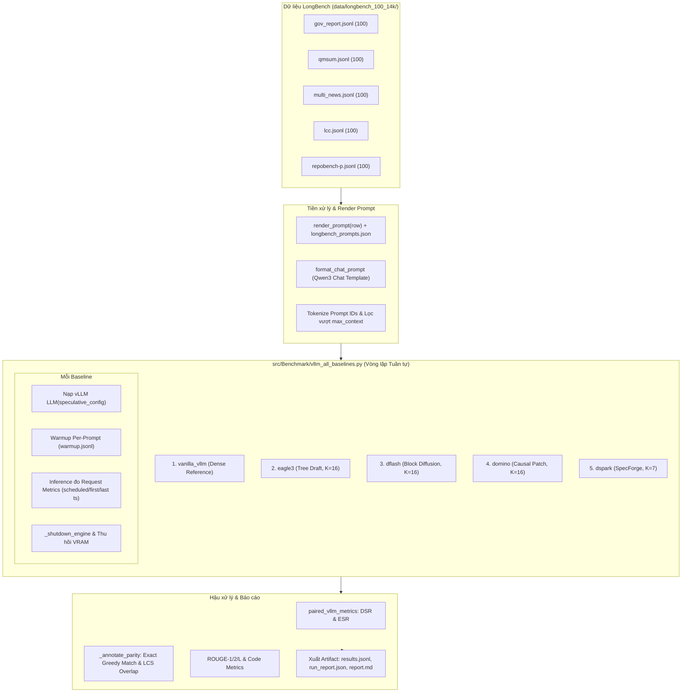

# Kế hoạch Triển khai Pipeline Benchmark vLLM Đồng Bộ cho `fast_infer_text_sum`

> **Mục tiêu:** Port và chuẩn hóa toàn bộ cơ chế benchmark vLLM đồng bộ (Synchronized vLLM Evaluation) từ `fast_infer_text_sum_Viet` sang `fast_infer_text_sum`, đặt trong package `src/Benchmark/`, hỗ trợ 5 baseline (`vanilla_vllm`, `dflash`, `eagle3`, `domino`, `dspark`) trên bộ dữ liệu LongBench tiếng Anh (`data/longbench_100_14k/`) và đồng bộ đường dẫn checkpoint server B200 (Qwen3-4B).

---

## 1. Tổng quan Kiến trúc & Phạm vi Triển khai

### A. Đối chiếu Giữa 2 Môi trường Repo

| Thành phần | `fast_infer_text_sum_Viet` (Nguồn) | `/home/tuantb/fast_infer_text_sum` (Đích) |
|---|---|---|
| **Vị trí Module** | `src/Benchmark/` | **Tạo mới `src/Benchmark/`** (chứa core runner, adapters & common helpers) |
| **5 Baseline So sánh** | `vanilla_vllm`, `eagle3`, `dflash`, `domino`, `dspark` | **Giữ nguyên 5 baseline** trên engine `vLLM 0.30.0` (V2 Model Runner) |
| **Dữ liệu Đánh giá** | 4 dataset tiếng Việt (`vietnews`, `wikilingua`, `vims`, `vlsp`) | **5 dataset LongBench** (`gov_report`, `qmsum`, `multi_news`, `lcc`, `repobench-p`) trong `data/longbench_100_14k/` |
| **Cơ chế Render Prompt** | Nối document trực tiếp vào prompt tiếng Việt | Đọc template từ **`longbench_prompts.json`** qua `render_prompt(record)` |
| **Ground-truth Reference** | Trường `reference` / `summary` | Ưu tiên `reference_output` $\rightarrow$ `answers[0]` $\rightarrow$ `reference` |
| **Chat Template Framing** | Qwen3 chat template (`[{"role": "user", "content": prompt}]`) | **Giữ nguyên chat template Qwen3** qua `format_chat_prompt(tokenizer, prompt)` |
| **Server Checkpoint Paths** | `/workspace/storage-shared/nlp/dungdx4/BERT/` (Qwen3-4B) | **Đồng bộ hóa 100%**: Sử dụng cùng checkpoint server Qwen3-4B và 4 draft models |

### B. Đường dẫn Checkpoint Canonical trên Server B200

```bash
MODEL_ROOT="/workspace/storage-shared/nlp/dungdx4/BERT"
MODEL_TARGET="$MODEL_ROOT/Qwen3-4B"
MODEL_EAGLE_DRAFT="$MODEL_ROOT/Qwen3-4B_eagle3"
MODEL_DFLASH_DRAFT="$MODEL_ROOT/Qwen3-4B-DFlash-b16"
MODEL_DOMINO_DRAFT="$MODEL_ROOT/Qwen3-4B-Domino-b16"
MODEL_DSPARK_DRAFT="$MODEL_ROOT/Dspark-Qwen3-4B-b7"
```

---

## 2. Sơ đồ Luồng Thực thi vLLM Đồng Bộ



---

## 3. Chi tiết các File Cần Triển khai / Chỉnh sửa tại `/home/tuantb/fast_infer_text_sum`

### Component 1: Core Benchmark Package (`src/Benchmark/`)

#### [NEW] `src/Benchmark/__init__.py`
- Khởi tạo package namespace `Benchmark`.

#### [NEW] `src/Benchmark/vllm_all_baselines.py`
- Điều phối thực nghiệm vLLM đồng bộ qua 5 baseline (`vanilla_vllm`, `eagle3`, `dflash`, `domino`, `dspark`).
- Hỗ trợ nạp dữ liệu đơn lẻ hoặc nạp cả thư mục `data/longbench_100_14k/`.
- Tích hợp `render_prompt(row)` từ `longbench_prompts.json`, `format_chat_prompt(tokenizer, prompt)`.
- Chạy warmup per-sample, đo đạc server timing (`prefill_ms`, `mean_itl_ms`, `e2e_ms`), thu hồi VRAM sau mỗi method.
- Xuất artifacts: `results.jsonl`, `run_report.json`, `report.md`, `samples.jsonl`, `warmup.jsonl`, `events.jsonl`.

#### [NEW] `src/Benchmark/common/__init__.py`
- Khởi tạo package con `Benchmark.common`.

#### [NEW] `src/Benchmark/common/vllm_pilot.py`
- Chứa toàn bộ logic Monkey-patching cho Domino (`install_domino_vllm_compat`, `domino_greedy_sample` chèn GRU prefix và causal projection head).
- Phân giải số speculative tokens (`speculative_token_count`) và auxiliary hidden state layers cho EAGLE3 (`resolve_eagle3_aux_hidden_state_layers`).
- Tính toán paired metrics (`paired_vllm_metrics`): DSR (Decode Speedup Ratio) và ESR (End-to-end Speedup Ratio).

#### [NEW] `src/Benchmark/common/vllm_pilot_plugin.py`
- Entrypoint đăng ký plugin cho vLLM worker process: `fast_infer_vllm_domino = Benchmark.common.vllm_pilot_plugin:register`.

#### [NEW] `src/Benchmark/common/prompt_format.py`
- Format prompt an toàn qua Qwen3 chat template (`apply_chat_template(messages, tokenize=False, add_generation_prompt=True, enable_thinking=False)`).

#### [NEW] `src/Benchmark/common/longbench_prompts.json`
- Chứa 5 prompt templates chuẩn cho `gov_report`, `qmsum`, `multi_news`, `lcc`, `repobench-p`.

#### [NEW] `src/Benchmark/common/benchmark_data.py`
- Đọc JSONL, phân giải prompt template LongBench, chuẩn hóa record.

#### [NEW] `src/Benchmark/common/io_util.py`, `quality_guard.py`, `rouge.py`, `speculative_metrics.py`
- Cung cấp tiện ích ghi stream `JsonlWriter`, kiểm tra lặp suy biến `is_degenerate_output`, tính ROUGE và chuẩn hóa acceptance counters.

#### [NEW] `src/fast_infer_vllm_plugin-0.1.0.dist-info/` (`entry_points.txt`, `METADATA`)
- Đăng ký vLLM General Plugin tự động cho môi trường runtime.

#### [NEW] `src/Benchmark/README.md`
- Tài liệu hướng dẫn kiến trúc, cơ chế đo lường và hướng dẫn vận hành benchmark vLLM đồng bộ.

---

### Component 2: Launchers & Config Integration (`scripts/`)

#### [NEW] `scripts/run_vllm_all.sh`
- Launcher shell nạp master config `fast_infer_master.env` (hoặc override qua `--config`), export các biến checkpoint Qwen3 chuẩn, thiết lập chế độ offline, ghi log console tee và thực thi `python -m Benchmark.vllm_all_baselines`.

#### [MODIFY] `scripts/run.sh`
- Bổ sung routing `vllm_all) WRAPPER="scripts/run_vllm_all.sh" ;;` vào dispatcher chính.

#### [MODIFY] `scripts/common/config.sh`
- Bổ sung hàm loader `fast_infer__load_vllm_all` và case `vllm_all` trong `fast_infer_load_config()`, thiết lập mặc định cho các biến:
  - `VLLM_TARGET_MODEL="${MODEL_TARGET:-/workspace/storage-shared/nlp/dungdx4/BERT/Qwen3-4B}"`
  - `VLLM_EAGLE3_MODEL="${MODEL_EAGLE_DRAFT:-/workspace/storage-shared/nlp/dungdx4/BERT/Qwen3-4B_eagle3}"`
  - `VLLM_DFLASH_MODEL="${MODEL_DFLASH_DRAFT:-/workspace/storage-shared/nlp/dungdx4/BERT/Qwen3-4B-DFlash-b16}"`
  - `VLLM_DOMINO_MODEL="${MODEL_DOMINO_DRAFT:-/workspace/storage-shared/nlp/dungdx4/BERT/Qwen3-4B-Domino-b16}"`
  - `VLLM_DSPARK_MODEL="${MODEL_DSPARK_DRAFT:-/workspace/storage-shared/nlp/dungdx4/BERT/Dspark-Qwen3-4B-b7}"`
  - `VLLM_DATA_FILE="${VLLM_DATA_FILE:-data/longbench_100_14k/gov_report.jsonl}"`

#### [NEW] `docs/baselines/vllm_unified.md`
- Tài liệu đặc tả quy trình chạy và tiêu chí đánh giá cho bộ dữ liệu LongBench.

---

### Component 3: Unit Tests (`tests/`)

#### [NEW] `tests/test_vllm_all_baselines.py`
- Kiểm tra toàn diện parser CLI (`--full`, `--smoke`, `--max-samples`).
- Kiểm tra tính toán `mean_itl_ms`, LCS token overlap, schema JSONL, parsing snapshot `nvidia-smi`.
- Kiểm tra render prompt và trích xuất reference trên các mẫu LongBench (`gov_report`, `lcc`).

#### [NEW] `tests/test_vllm_pilot.py`
- Kiểm tra phân giải speculative block size ($K=16$ cho EAGLE/DFlash/Domino, $K=7$ cho DSpark).
- Kiểm tra phân giải EAGLE3 auxiliary layer IDs.
- Kiểm tra thuật toán `domino_greedy_sample` với GRU prefix và causal correction trên CPU tensors.
- Kiểm tra công thức DSR và ESR trong `paired_vllm_metrics`.

---

## 4. Kế hoạch Thực hiện Từng bước (Step-by-Step Tasks)

```markdown
- [ ] **Task 1: Tạo cấu trúc package `src/Benchmark/` và các tiện ích dùng chung**
  - Tạo `src/Benchmark/__init__.py`, `src/Benchmark/common/__init__.py`
  - Tạo `src/Benchmark/common/prompt_format.py`, `longbench_prompts.json`, `benchmark_data.py`, `io_util.py`, `quality_guard.py`, `rouge.py`, `speculative_metrics.py`
  - Tạo `src/fast_infer_vllm_plugin-0.1.0.dist-info/entry_points.txt` và `METADATA`

- [ ] **Task 2: Triển khai Adapter vLLM Pilot & Domino Compat (`src/Benchmark/common/vllm_pilot.py`)**
  - Implement `install_domino_vllm_compat`, `domino_greedy_sample`
  - Implement `resolve_eagle3_aux_hidden_state_layers`, `speculative_token_count`
  - Implement `paired_vllm_metrics` (tính DSR, ESR)

- [ ] **Task 3: Triển khai Core Runner `src/Benchmark/vllm_all_baselines.py`**
  - Tích hợp chuẩn bị mẫu LongBench (`_prepare_samples`), render prompt động
  - Tích hợp vòng lặp chạy tuần tự 5 baseline, warmup per-prompt, trích xuất server metrics
  - Tích hợp đối soát Parity (`_annotate_parity`), tổng hợp metrics và xuất đầy đủ artifacts

- [ ] **Task 4: Thiết lập Shell Launchers & Cập nhật Master Config Loader**
  - Tạo `scripts/run_vllm_all.sh`
  - Cập nhật `scripts/run.sh` và `scripts/common/config.sh`
  - Tạo tài liệu `docs/baselines/vllm_unified.md` và `src/Benchmark/README.md`

- [ ] **Task 5: Tạo Bộ Kiểm thử Unit Tests & Xác thực (Verification)**
  - Tạo `tests/test_vllm_pilot.py` và `tests/test_vllm_all_baselines.py`
  - Chạy `pytest` trên CPU với `CUDA_VISIBLE_DEVICES=""`
  - Chạy thử nghiệm cú pháp bash và import preflight
```

---

## 5. Kế hoạch Kiểm tra & Xác nhận (Verification Plan)

### Automated Tests (Local CPU Verification)
```bash
# 1. Chạy unit tests cho vllm_pilot và vllm_all_baselines
CUDA_VISIBLE_DEVICES="" /home/tuantb/fast_infer_text_sum/.venv/bin/pytest -v \
  /home/tuantb/fast_infer_text_sum/tests/test_vllm_pilot.py \
  /home/tuantb/fast_infer_text_sum/tests/test_vllm_all_baselines.py

# 2. Chạy toàn bộ test suite của repo để đảm bảo không có hồi quy (regression)
CUDA_VISIBLE_DEVICES="" /home/tuantb/fast_infer_text_sum/.venv/bin/pytest -q \
  /home/tuantb/fast_infer_text_sum/tests

# 3. Kiểm tra cú pháp script shell
bash -n /home/tuantb/fast_infer_text_sum/scripts/run_vllm_all.sh
bash -n /home/tuantb/fast_infer_text_sum/scripts/run.sh
```

### Preflight Verification trên Server B200 (khi đưa lên server)
```bash
# Kiểm tra model paths, tokenizer, package offline
bash scripts/run_vllm_all.sh --preflight-only

# Chạy smoke test nhanh (2 mẫu)
bash scripts/run_vllm_all.sh --smoke

# Chạy full benchmark 5 baseline trên dataset LongBench
bash scripts/run_vllm_all.sh --full
```
