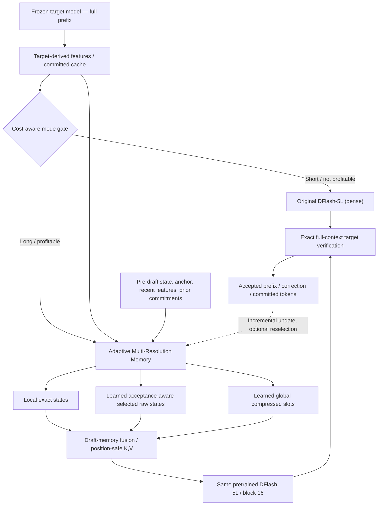

# AMR-DFlash: Adaptive Multi-Resolution Memory for Long-Context Diffusion Speculative Decoding

> **Research design & paper-story summary — 08/10/2026**  
> **Status:** Đề xuất đang thiết kế / chưa có kết quả huấn luyện hay benchmark inference cho AMR-DFlash.  
> **Priority:** *Acceptance-first*, cost-aware, giữ pretrained DFlash và full-context target verification.  
> **Đề tài lớn hơn:** Efficient Inference for Long-Document Text Summarization.

---

## Executive summary

**Một câu về ý tưởng:** Chúng ta không chỉ làm cho DFlash *đọc ít context hơn*, mà **học cách tổ chức và phân bổ context giúp DFlash đưa ra các draft blocks dễ được target chấp nhận hơn**, nhờ đó **giảm số verification rounds đắt đỏ** khi xử lý long context.

**Đề xuất:** Giữ pretrained DFlash block-parallel; thêm một *Adaptive Multi-Resolution Memory (AMR)* có (i) local exact memory, (ii) learned, state-conditioned selection của các target-derived states quan trọng cần giữ nguyên độ phân giải, (iii) learned global compressed memory để bổ sung thông tin phân tán mà selection bỏ sót. Một hardware/cost-aware gate quay về DFlash gốc ở short context; target verifier luôn dùng full context.

**Thay đổi cốt lõi so với ý tưởng MR-DFlash ban đầu:**

1. **Optimization target:** tăng *expected accepted prefix / committed tokens per second*, **không** lấy attention coverage, compression ratio hay draft FLOPs làm mục tiêu cuối.
2. **Training signal:** học *acceptance utility* từ các context interventions và target verification; **không bắt buộc attention-guided warm-up**. Attention chỉ là diagnostic/candidate generator/baseline.
3. **Architecture:** dùng DFlash pretrained 5-layer / block 16 làm nền kiểm soát; *selection + complementary compression* thay vì mặc định sao chép HCA/CSA hay giảm số layer.
4. **Systems economics:** do verification khoảng **6 lần** drafting trong profiling do người nghiên cứu cung cấp (cấu hình chính xác còn cần ghi), việc tiết kiệm riêng draft time có trần speedup hạn chế; tác động chính kỳ vọng đến từ tăng acceptance và giảm số verifier calls.
5. **Scientific claim:** quan sát attention tạo động cơ, **không tự chứng minh** chọn ít context tăng acceptance. Đây là hypothesis cần xác minh bằng can thiệp và online rollout.

**Paper-level claim được nhắm tới (chưa đạt):** *Learned, acceptance-aware allocation of high-resolution and complementary compressed context can counteract long-context degradation of a pretrained diffusion drafter, while preserving exact target verification and short-context performance.*

---

## 1. Problem: chúng ta thực sự muốn giải quyết điều gì?

### 1.1. Nền tảng inference

Gọi target autoregressive model là \(T\) và pretrained diffusion/block-parallel drafter là \(D_{\theta_0}\).

Tại speculative round \(t\), target đã xử lý toàn bộ prefix gồm prompt và các token đầu ra đã commit, cung cấp target hidden features:

\[
H_t=[h_1,\ldots,h_{N_t}],\qquad h_i\in\mathbb R^{d_H}.
\]

Ở checkpoint dùng cho phân tích attention, DFlash lấy features từ target layers \([1,9,17,25,33]\). Các features được fuse/project theo thiết kế gốc để tạo **context K/V của DFlash**. **Đây không phải bản sao raw target K/V cache.**

DFlash gốc có 5 draft layers, mỗi round có **16 live positions = 1 anchor + 15 proposal positions**, kết hợp các context states để dự đoán block song song:

\[
q_t^{\rm full}=D_{\theta_0}(B_t,H_t).
\]

Target verifier kiểm tra proposal trên **full original context/KV** với verification/correction scheme đúng của speculative decoding.

### 1.2. Long-context challenge có hai vế

- **Draft conditioning cost:** context K/V dài làm tăng lượng K/V được đọc/tính trong draft attention; trong block-parallel decoding với số query cố định \(K\), thành phần cross-attention điển hình tăng khoảng \(O(KN_td)\), **không phải** \(O(N_t^2)\).
- **Target–draft mismatch:** pretrained drafter có năng lực hạn chế; full memory có thể bao gồm nhiều states ít giá trị cho bước dự đoán hiện tại. Một tập *được chọn đúng* có khả năng cải thiện logits/accepted prefix — **đây là giả thuyết, chưa có bằng chứng nhân quả trên DFlash**.

Vấn đề chính **không** phải “tất cả long context đều thừa” mà là: **những thông tin nào nên có độ phân giải cao và những thông tin nào chỉ cần được giữ dạng tổng hợp ở mỗi draft round?**

### 1.3. Vì sao cần acceptance-first?

Profiling do người nghiên cứu thông báo: một verification round mất khoảng \(6\times\) một draft round. Nếu chuẩn hóa \(T_D=1\), \(T_V=6\), khi giữ nguyên số committed tokens per round:

\[
\operatorname{Speedup}_{\text{draft only}}(s)
=\frac{T_D+T_V}{T_D/s+T_V}
=\frac{7}{6+1/s}.
\]

Ngay cả khi draft time giảm về 0, speedup vòng chỉ có trần \(7/6\approx1.167\times\), **nếu** acceptance/verification time và overhead khác không đổi. Tỷ lệ này chưa được xác nhận trên mọi context length, batch size và hardware; không dùng nó như kết quả hệ thống tổng quát.

Cơ hội lớn hơn là tăng số token được commit trong mỗi lần verifier chạy:

\[
\boxed{
U\;\equiv\;\frac{\mathbb E[\text{committed tokens/round}]}{
\mathbb E[T_{\rm select}+T_{\rm compress/update}+T_{\rm gather}+T_{\rm draft}+T_{\rm verify}+T_{\rm other}]}
}.
\]

Tối ưu cuối cùng là **decode committed tokens/s** và **end-to-end summarization latency**; acceptance là đòn bẩy chính, memory cost là điều kiện ràng buộc.

> Cần tách **accepted proposal length \(A\)** và **số committed tokens \(G\)**: correction/bonus/EOS làm \(G\) không luôn bằng \(A+1\). Với K=16 live positions có 15 proposal positions, \(A\in\{0,\ldots,15\}\) nếu đếm proposals theo mô hình hiện tại. \(\mathbb E[A]=\sum_{j=1}^{15}P(A\ge j)\). Đo \(G\) trực tiếp từ verifier để tránh nhầm định nghĩa.

---

## 2. Empirical evidence hiện có: DFlash attention behavior

### 2.1. Nguồn, thiết lập và provenance

Bằng chứng chính lấy từ ZIP `bao_cao_phan_tich.zip`, nhóm `nhom_1_dflash_attention_analysis`, các thí nghiệm D0–D4 (06/10/2026):

- **Target:** Qwen3-4B; **Drafter:** Qwen3-4B-DFlash-b16, 5 draft layers; checkpoint upstream trong D0–D4 (không mặc nhiên đồng nhất với checkpoint tự train hoặc MR variant).
- **Dữ liệu:** 10 GovReport documents; prompt caps 3,072 / 5,120 / 8,192 / 16,384 tokens; 40 trajectories và 4,366 draft rounds; 40/40 trajectories kết thúc đúng EOS.
- **Hạ tầng khảo sát:** NVIDIA L40S trên Modal; attention collector có instrumentation (DFlash eager, target SDPA); **không lấy timing của collector làm latency benchmark production**.
- **Thống kê:** D2/D2-C và D3/D4 phân tích/replay cùng cohort, **không phải** dữ liệu độc lập tăng sample size; các rounds cùng document có tương quan. Không gộp các kết quả training-free E41–E44 (target Qwen3-0.6B) như thể là DFlash experiments.
- **Phạm vi key:** phân biệt (i) `full keys` có cả live block, (ii) `cache keys` = prompt + committed output, loại live block. **Block 16 phải luôn được giữ khi thử sparse-context inference**.

### 2.2. Các quan sát có số liệu

| Observation trên cohort 16K | Kết quả | Interpretation hợp lệ | Không được suy ra |
|---|---:|---|---|
| Top-1K / Top-4K trên **mọi key** | **67.29% / 82.61%** full attention mass | Key được ưu tiên không phân bố đều | 1K/4K đảm bảo retained acceptance tương ứng |
| Best contiguous window cùng budget | **49.61% / 63.36%** full mass | Scattered Top-K bao phủ mass tốt hơn cửa sổ liên tiếp | Scattered Top-K là causal optimum |
| Top-1K / Top-4K trên **cache keys** | **58.58% / 77.96%** cache mass | Có long-tail mass đáng kể phía memory sẽ bị cắt | Tail mass bị bỏ = cùng tỷ lệ accuracy loss |
| Top-64 trên **mọi key**; key count để đạt 90% mass | **46.53%**; khoảng **7,035 keys** | Cùng tồn tại focus mạnh và broad residual | Attention uniform hoặc chỉ 64 keys là đủ |
| Cache Top-1K support overlap: adjacent / middle-to-last | **82.65% / 31.11%** | Reuse gần hạn + refresh theo state là khả thi để thử | Fixed refresh frequency đã được chứng minh |
| Target vs DFlash Top-1K overlap cùng lượt | **19.8%** | Attention rankings hai model khác nhau rõ | Target attention hoàn toàn vô ích |
| Parent target Top-1K → DFlash next-round cache mass | **38.01%** | Direct target-attention copy chưa là default tốt | Không thể học ánh xạ từ target hidden features |
| Shared Top-1K coverage giữa draft layers | khoảng **49.38–69.64%** (theo layer) | Có heterogeneity giữa layers | Mỗi layer cần một selector riêng |

**Bổ sung:** tại 16K, prompt ~58.80%, committed output ~19.85%, live block ~21.35% của full attention mass (aggregate trong cohort). Không được hiểu các tỷ lệ này là thông tin hữu ích tương đương. D4 có **4,326 parent transitions đều dùng correction queries**, chưa quan sát `literal bonus-to-next-draft` transitions; không tuyên bố bonus-attention signal đã được kiểm định.

### 2.3. Những insight rút ra một cách thận trọng

- **O1 — Non-uniform but broad memory use:** Có một nhóm key được ưu tiên nhưng vẫn có background long tail. Điều này *motivate* hybrid high-resolution selection + global summary, **không chứng minh hybrid cần thiết**.
- **O2 — Time-varying support:** Key relevance có locality giữa các rounds gần nhau, nhưng drift theo quá trình generation. Điều này *motivate* online state-conditioned selection cùng temporal reuse.
- **O3 — Target/drafter mismatch:** Target attention là một heuristic đáng thử nhưng không nên là nhãn chính mặc định cho DFlash selector. Target **hidden states** vẫn là đầu vào cần thiết và khác với target **attention rankings**.
- **O4 — Layer heterogeneity:** Learned per-layer allocation là extension có cơ sở nhưng chỉ thêm khi shared support kém về acceptance tại cùng cost.
- **O5 — Context sufficiency chưa được đo:** Các attention concentration/mass coverage **không trực tiếp chứng minh** rút gọn context giữ/tăng logits agreement, accuracy hay accepted length.

### 2.4. Liên hệ với nhánh training-free trước đây

Các E41–E44 trên Qwen3-0.6B cho thấy attention/head heterogeneity, temporal support reuse và giới hạn của fixed oracle/gating/quantization khi đưa vào ràng buộc cost/tail risk. Đây là **kinh nghiệm thiết kế hệ thống** (đặc biệt về overhead, tail failure và reuse), không phải bằng chứng của learned AMR-DFlash. Điểm nối hợp lý:

\[
\text{Observed sparse/structured attention}
\not\Rightarrow\text{free speedup or preserved accuracy};
\quad
\text{need causal and cost-aware memory allocation}.
\]

---

## 3. Scientific hypotheses và paper story

### 3.1. Central research question

> **Can acceptance-aware adaptive multi-resolution memory improve long-context draft–target alignment and accepted prefix length of a pretrained diffusion drafter, without retraining its backbone or penalizing short-context inference?**

### 3.2. Hypotheses cần kiểm định

- **H1 — Acceptance-optimal context differs from attention-optimal context.** Context chọn theo *causal contribution to acceptance* có thể tốt hơn Top-K attention/position heuristics dù giữ cùng budget.
- **H2 — Query/state-conditioned selection matters.** Một tập key giữ độ chi tiết cao phụ thuộc draft round và trạng thái đã commit có thể tốt hơn fixed head/middle/recent/random windows.
- **H3 — Selection and global compression can be complementary.** Nếu selected raw key budget hạn chế làm mất information hữu ích, learned low-resolution slots có thể phục hồi một phần thông tin cần để tăng acceptance.
- **H4 — Acceptance improvements dominate draft-time savings under verifier-heavy profiles.** Tăng committed tokens mỗi verification call có thể tăng throughput hơn chỉ giảm draft FLOPs, nếu overhead AMR được kiểm soát.
- **H5 — Adaptive bypass preserves short-context economics.** Không dùng AMR khi cost model dự báo không có lợi giúp tránh giảm performance ở prompt ngắn.

**Các giả thuyết chưa được chứng minh.** Không viết trong paper theo thì đã thành công cho tới khi có paired intervention + online benchmark trên holdout.

### 3.3. Core narrative (Problem → Insight → Method → Mechanism → Outcome)

1. **Problem:** DFlash phải condition lên growing target-derived context; long-context decode có nguy cơ tăng chi phí và giảm draft–target alignment (cần profile xác minh thật sự có degradation do context length).
2. **Insight:** DFlash attention tập trung nhưng có tail, drift theo trạng thái, có layer differences và không tương đồng trực tiếp với target-attention score.
3. **Gap:** Existing context pruning có thể tập trung vào attention proxy; learned compression kiểu MASW ưu tiên lịch sử xa của AR drafter. Chưa đủ bằng chứng rằng những cơ chế đó là *acceptance-optimal* cho block-parallel DFlash.
4. **Method:** Học một **working memory phân giải thích ứng** gồm local exact, dynamic selected raw features và global compressed complementary memory; giữ frozen pretrained backbone.
5. **Learning:** Train từ **actual verifier acceptance/preferences** của nhiều candidate context subsets tại cùng trạng thái; dùng target-alignment/survival surrogate cho differentiable compressor; attention không phải loss chính.
6. **Expected mechanism:** Chọn bớt distractors, giữ evidence quan trọng và bù background → logits gần target hơn → tăng survival/accepted prefix → giảm verification calls cho cùng output; tiết kiệm draft memory là secondary.
7. **Success criteria:** tăng accepted prefix và **measured committed tokens/s**, có lợi E2E khi phù hợp, không chậm short context, không thay target output distribution và generalize qua documents/context lengths/batches.

---

## 4. Proposed method: AMR-DFlash

### 4.1. Sơ đồ khái niệm

**V1 full-method pilot:** implementation có cả selector + compressor + gate nhưng các nhánh **có thể tắt độc lập**, phục vụ ablation và fallback. Không coi compressor có lợi cho đến khi test selection-only vs hybrid. Có thể dùng baseline cached/precomputed full-context teacher để tạo nhãn, nhưng **không chạy dense teacher tại inference**.

### 4.2. Working memory và budget

Tại round \(t\), giả sử tập cache positions đã commit là \(\mathcal C_t\) và 16 live block positions là \(\mathcal B_t\). AMR xây memory:

\[
\boxed{\mathcal M_t=
\mathcal M_{\rm local,t}
\cup\mathcal M_{\rm select,t}
\cup\mathcal M_{\rm global,t}}
\]

với:

\[
\begin{aligned}
\mathcal M_{\rm local,t}&=\operatorname{ExactRecent}(H_t,W)\;\text{(+ optional small sink guard)},\\
\mathcal M_{\rm select,t}&=\{h_i:i\in\mathcal S_t\},\\
\mathcal M_{\rm global,t}&=G_\eta(H_{\rm historical};\text{incremental state}).
\end{aligned}
\]

Các local/sink positions là guard chống mất thông tin, được **trừ trong raw budget**, tránh double counting. Tránh trùng positions giữa local và selected. \(H_{\rm historical}\) là toàn bộ history được cập nhật dần; **không nén lại toàn bộ complement \(H_{\mathcal C_t\setminus\mathcal S_t}\) mỗi speculative round** nếu không có chiến lược incremental.

Nếu tổng budget draft context là \(B\):

\[
B=B_{\rm raw}+B_{\rm slots},\qquad
|\mathcal M_{\rm local}\cup\mathcal M_{\rm select}|\le B_{\rm raw},\quad
|\mathcal M_{\rm global}|=B_{\rm slots}.
\]

**Live 16-position block không tính vào \(B\)** và không bị rút gọn.

*Pilot configuration để thử, không phải optimum:* context length 3K/5K/8K/16K, raw budgets 1K/2K/4K/8K; thử local window 128/256 và slots 64/128; trước hết dùng shared-support selector, sau đó xem per-layer extension.

### 4.3. Learned state-conditioned selector

Tạo compact index cho mỗi committed target-derived feature, khi token được commit:

\[
k_i=W_Kh_i\in\mathbb R^{d_r}.
\]

Trước khi tạo draft block ở round \(t\), build query từ **thông tin đã có trước draft**:

\[
u_t=f_\phi(z_t),\qquad
z_t=\operatorname{Fuse}(\text{anchor},\text{recent target states},\text{committed history metadata},\ldots).
\]

Score:

\[
s_{t,i}=\frac{u_t^\top k_i}{\sqrt{d_r}}+b_\phi(\text{relative position}_i,\text{prompt/output flag}_i).
\]

Chọn dynamic support:

\[
\mathcal S_t=\operatorname{TopK}_{B_{\rm raw}-|\mathcal M_{\rm local,t}|}
\{s_{t,i}\mid i\notin \mathcal M_{\rm local,t}\}.
\]

**Không dùng** current-round dense DFlash attention hoặc current-round target verification như input của selector khi inference. Các tín hiệu này chỉ có thể xuất hiện trong *offline label generation*. Previous-round target attention là optional ablation, không phải teacher mặc định.

**Layer-aware extension** (chỉ triển khai nếu cần): \(u_{t,\ell}=f_\phi(z_t,e_\ell)\), cấp subset riêng cho từng draft layer. Đây là lựa chọn tốn metadata/gather; phải so cùng total budget và CUDA latency.

### 4.4. Learned complementary compressed global memory

Một compressor cập nhật các slots biểu diễn thông tin bổ trợ của lịch sử xa:

\[
R_t=G_\eta(H_{\le t};R_{t-1}),\qquad R_t\in\mathbb R^{B_{\rm slots}\times d_M}.
\]

**Nó không học reconstruct raw tokens, và cũng không được mặc định học attention mass.** Nhiệm vụ là thêm thông tin để **DFlash dự đoán gần target hơn và tăng accepted prefix** trong khi tiêu tốn ít entries.

Cần adapter đưa slot representations vào K/V của mỗi DFlash layer:

\[
(K_{\ell}^{\rm slot},V_{\ell}^{\rm slot})=P_{\eta,\ell}(R_t).
\]

Các raw selected states giữ absolute positions/RoPE như bản gốc. Learned slots cần quy tắc vị trí và normalization rõ ràng (slot positions, bias/temperature, attention scaling) vì softmax sẽ **renormalize** sau pruning/fusion. Không thể chỉ concat vector nén một cách tùy tiện rồi giả định pretrained DFlash hiểu được.

**HCA/CSA là nguồn cảm hứng kiến trúc, không bắt buộc trong bản pilot.** Nếu chọn HCA/CSA, mỗi thành phần phải chứng minh utility/cost và tránh tạo thêm một cross-attention pass đắt.

### 4.5. Online memory lifecycle

1. Target verifier giữ full KV và commit \(c_t\) tokens hợp lệ; loại temporary/rejected proposals khỏi persistent bank.
2. Incrementally append corresponding target-derived features/compact indexes và cập nhật global slots (theo schedule được profile).
3. Reuse support trong vài rounds nếu state và cost model cho phép; vẫn có cơ chế global rescore/retrieval để key ngoài support có thể quay trở lại.
4. Tạo working memory, draft K positions, verify với original target/correction; preserve rollback, EOS và positional semantics.
5. Với short context hoặc khi predicted utility không đủ bù overhead, bypass về dense DFlash; nếu lazy index build, tính chi phí warm-up/switching đầy đủ.

### 4.6. Routing, budget và cost-aware gate

V0: threshold được calibrate theo **context length × batch size × hardware**. V1 mới thêm recent acceptance và empirical latency để điều chỉnh memory budget/gate.

\[
m_t=\arg\max_{m\in\{\mathrm{dense},\mathrm{AMR}\}}
\widehat U_m(N_t,b_t,\mathrm{acceptance\ history},\mathrm{cost\ estimates}).
\]

Không cần một learned router mới trong pilot nếu rule-based threshold đủ hiệu quả. Trong short context, ưu tiên zero/near-zero AMR overhead.

---

## 5. Training: Acceptance-Driven Memory Learning (quyết định hiện tại)

### 5.1. Học cái gì? Không phải tái tạo attention

**Đã chốt thay đổi:** **Bỏ Attention-Guided Warm-Up khỏi phần bắt buộc**. Trước đây định học \(s_{t,i}\approx a_{t,i}^{DFlash}\); nhưng cái ta thực sự muốn là:

\[
\boxed{\mathcal S_t^*=\arg\max_{\mathcal S:\,|\mathcal S|\le B}
\mathbb E[A_t\mid z_t,\mathcal S]}
\]

hoặc chính xác hơn ở mức hệ thống:

\[
\boxed{\pi^*=\arg\max_\pi
\mathbb E\left[\frac{\sum_tG_t}{\sum_tT_t}\right]}
\]

với \(\pi\) quyết định selection/compression/mode/budget. Đây là optimization intent; tìm tối ưu toàn cục trên \(2^{N_t}\) subsets là bất khả thi, nên cần candidate search + supervised surrogate + online measurement.

**Attention chỉ còn dùng cho**: tạo diverse candidate subsets, phân tích behaviors, diagnostic, và ablation baseline `attention imitation`. Không lấy high attention = high usefulness làm tiên đề.

### 5.2. Training data: state-conditioned acceptance preference

Trên mỗi fixed draft state \(z_t\) từ full target + committed prefix:

1. Tạo tập ứng viên cùng budget \(\{C_t^{(1)},\ldots,C_t^{(m)}\}\): recent/head/middle/random contiguous/random scattered, DFlash attention Top-K (diagnostic offline), parent-target Top-K, incremental reuse và *chunk swap/mix*; những ứng viên tốt có thể làm seed cho local search.
2. Chạy **cùng frozen DFlash** dưới từng context subset, không thay target input/hidden history.
3. Chạy full target verification đúng algorithm; log \(A_t^{(i)}\), \(G_t^{(i)}\), survival \(P(A\ge j)\), logit agreement/alignment, cùng latency.
4. Nếu stochastic speculation, estimate \(\mathbb E[A_t\mid C]\) bằng nhiều replicates/common-random-number strategies phù hợp; không rank bằng một mẫu ngẫu nhiên duy nhất. Với greedy, paired comparison vẫn cần kiểm soát prefix/truncation/EOS.
5. Tạo pairwise preference hoặc set-level utility labels từ những context subsets làm acceptance tốt hơn (có threshold xử lý ties/noise).

Score của một selected set có thể được dựng từ token/chunk logits hoặc từ learned set scorer:

\[
F_\phi(z_t,C)=\operatorname{Aggregate}_{i\in C}s_\phi(z_t,h_i)\quad
\text{(V1; không mô hình hóa hết tương tác giữa chunks)}.
\]

Train preference ranking:

\[
\boxed{\mathcal L_{\rm pref}
=\log\bigl(1+\exp[-(F_\phi(z_t,C^+)-F_\phi(z_t,C^-))]\bigr).}
\]

Có thể thay bằng listwise ranking / contextual bandit offline trong phiên bản sau. **Causal chunk utility** \(\Delta_c\) đo khi remove/swap chunk so với một reference context, không phải global oracle; các chunks tương tác phi tuyến và reward ranking có thể khác theo tập đã chọn.

### 5.3. Compressor training với frozen drafter

Khi selector có một support hợp lý, train \(G_\eta,P_{\eta,\ell}\) qua frozen DFlash bằng objective differentiable **ở cùng conditioning prefix**:

\[
\mathcal L_{\rm align}(\eta)
=\sum_{j=1}^{15} w_j
D_{\rm KL}\!\left(p_T^{(j)}(\cdot\mid x,y_{<j})\;\|\;
q_{\rm AMR}^{(j)}(\cdot\mid x,y_{<j})\right).
\]

Ở đây logits phải được đánh giá/align trên **cùng history/prefix** tại từng candidate position; không tùy tiện KL hai distributions điều kiện trên các prefix khác nhau. \(w_j\) có thể hướng tới prefix survival, nhưng weighted KL **chỉ là surrogate** cho acceptance.

Quan trọng:

- DFlash frozen nhưng để train memory qua downstream DFlash cần backprop gradient qua **forward của frozen backbone đến input/slot**; không mặc định training time rẻ tỷ lệ với số trainable params.
- Hard Top-K **không khả vi theo selected indices**. Loss KL không tự truyền gradient vào selector nếu dùng plain gather; cập nhật selector qua \(\mathcal L_{\rm pref}\) hoặc differentiable relaxation/estimator riêng.
- Có thể thêm reference DFlash distillation để ổn định **nếu xảy ra distribution shift**, nhưng không để imitate old DFlash trở thành mục tiêu cuối khi old DFlash đang mismatch target.
- Không train decoder mới từ đầu. Target \(T\) và DFlash \(\theta_0\) frozen ban đầu; chỉ mở LoRA nhỏ nếu evidenced bottleneck là adaptation với memory slot.

### 5.4. Joint adaptation / full-method pilot

Để tránh training từ random toàn bộ module thiếu ổn định, đề xuất *đào tạo tuần tự nhưng đánh giá một full integrated system*:

- **Phase I — Preference labeling & selector fit:** train selector từ actual accepted-prefix utilities, **không bắt buộc attention teacher**.
- **Phase II — Complementary memory fit:** freeze selector, train global slots/adapters qua target alignment (và accepted-prefix validation).
- **Phase III — Lightweight joint calibration:** fine-tune phần nhỏ của cả hai module với alternating updates hoặc differentiable relaxation nếu cần; gate được calibrate bằng latency. Chỉ scale khi pilot có gain.

**Paper-level ideal objective:**

\[
\max_{\phi,\eta}\ \mathbb E[A_t]
\quad\text{s.t.}\quad
T_{\rm AMR}\le T_{\max},\ B\le B_{\max},
\]

và cuối cùng \(\max U\). **Implementation** dùng ranking labels / differentiable alignment surrogates rồi *validate* bằng actual target verification. Tránh tuyên bố model được end-to-end backprop trực tiếp từ discrete accepted length khi chưa cài đặt estimator thích hợp.

### 5.5. Cost–benefit gate (minh họa)

Nếu \(T_D=1,T_V=6\), cần:

\[
\frac{\mathbb E[G_{\rm AMR}]}{\mathbb E[G_{\rm dense}]}
>
\frac{6+T_{D,\rm AMR}+T_{\rm AMR\ overhead}}{7}
\]

để cải thiện committed tokens/s (giả định verifier time không đổi). Ví dụ nếu tổng overhead làm round time từ 7 lên 7.5, phải tăng committed tokens/round **hơn ~7.1% chỉ để hòa vốn**. Các số ví dụ không phải forecast của AMR.

---

## 6. Experiments: full-method pilot trước, ablation sau — nhưng cần sanity gate

**Quyết định tổ chức:** Không nghiên cứu vô hạn từng component trước khi chạy proposal. **Dựng một full AMR prototype có thể chạy end-to-end sớm**, tiến hành pilot cỡ nhỏ, rồi ablation để giải thích gain. Vẫn bắt buộc có sanity/causal check rất ngắn nhằm tránh train module trên một interface/pruning implementation sai.

### 6.1. P0 — Implementation & causal sanity (ngắn, có điều kiện dừng)

- Giữ nguyên Qwen3-4B/DFlash-b16 checkpoint, dtype/backend, prompt/prefix và 16 live block positions; **full-context target hidden** tính trước, chỉ cắt **DFlash-side** context.
- Đối chứng tại same fixed-state: FULL, RECENT, HEAD, MIDDLE, RAND-WINDOW, RAND-SCATTERED, DFlash-current-attention Top-K (offline diagnostic), previous-DFlash selection, parent-target-attention Top-K, greedy chunk-swap utility. Thử 1K/4K/8K ở 16K; nhiều seeds cho random.
- Đo actual accepted prefix, logits alignment, block position survival, committed count. DFlash-current Top-K dùng full forward **không phải online efficient method**.
- **Kill switch:** Nếu best candidates không có acceptance headroom, hoặc latency min khả thi đã quá cao, giảm scope/đổi method trước khi train full module.

### 6.2. P1 — Full-method pilot (mốc quan trọng đầu tiên)

- Build + train selector từ offline context preference labels.
- Build + train compact global memory slots với frozen DFlash; nối cả local/selected/slot branches, có `enable_selector`/`enable_compressor` flags.
- Chạy free-running complete speculative rollouts trên dev documents, logging từng round. Đánh giá **real gain** tại 8K/16K và no-regression tại short contexts.
- Bắt đầu pilot chỉ một backbone; không đồng thời giảm số draft layers hoặc thay block size (để attribution rõ ràng).

### 6.3. P2 — Ablation sau khi có full method

| Variant | Selector | Global slots | Acceptance-aware labels | Câu hỏi |
|---|---|---|---|---|
| Dense DFlash | — | — | — | Baseline checkpoint |
| Fixed recent / random / static Top-K | Heuristic | — | — | Cần học selector không? |
| Target-attn / prev-DFlash-attn | Training-free proxy | — | — | Signal heuristic nào đủ tốt? |
| Selection-only | Learned | — | ✓ | Selector đóng góp bao nhiêu? |
| Compression-only | — | Learned | surrogate | Tail/global memory có ích không? |
| Full AMR | Learned | Learned | ✓ | Có bổ trợ thật không? |
| Full AMR + attention imitation | Learned | Learned | mixed | Acceptance labels có tốt hơn attention imitation? |
| Full AMR w/o reuse | Learned | Learned | ✓ | Temporal caching giảm overhead bao nhiêu? |
| Shared vs layer-aware selection | Learned | Optional | ✓ | Heterogeneity đáng chi phí không? |
| No gate vs adaptive gate | Learned | Learned | ✓ | Short-context protection/crossover? |

**So cùng budget**: raw+slots phải được accounting nhất quán, cùng target, same proposals/block configuration, same kernel. Không đánh đồng attention mass coverage và actual acceptance. Nếu compression-only hoặc selection-only nhanh/tốt hơn full hybrid, loại module thừa khỏi final method.

### 6.4. P3 — Context degradation và generalization

- Re-evaluate 3K / 5K / 8K / 16K với cùng document IDs khi có thể, nhưng báo rõ prompt nội dung thay đổi theo cap. Thêm controlled distractor/position perturbation experiments để phân biệt length và semantic distribution shift; target continuation cũng có thể thay đổi do prompt khác.
- Đánh giá documents **ngoài 10 GovReport đã dùng để hình thành hypothesis**; mở rộng sang GovReport holdout, Multi-News, QMSum và các long-document summarization subsets phù hợp.
- Thử batch size khác nhau, throughput/goodput, memory footprint, với cùng target/prompt/output length protocol.
- Dữ liệu train/calibration/test tách theo **document**, bootstrap CI theo document (không giả định hàng nghìn rounds độc lập).

### 6.5. Metrics bắt buộc

**Quality of speculative decoding (primary mechanism):**

\[
\mathbb E[A],\quad P(A\ge j),\quad\mathbb E[G],\quad
\mathrm{TV/KL}(p_T,q_D)\ \text{(conditioned correctly)}.
\]

**System (final outcome):**

\[
\operatorname{cost/token}=\frac{\sum_t T_t}{\sum_t G_t},\qquad
\operatorname{decode\ throughput}=\frac{\sum_t G_t}{\sum_t T_t}.
\]

Report `T_select`, `T_index/update`, `T_compress`, `T_gather`, `T_draft`, `T_verify`, `T_prefill`, decode/E2E, TTFT/TPOT, p50/p95, peak draft-only memory và total VRAM. **Masked dense attention không là bằng chứng acceleration**: cần sparse gather/kernel physical execution.

**Exactness & task-level:** nếu verifier/correction chuẩn, đầu ra giữ target distribution bất kể drafter quality; verify implementation correctness bằng greedy parity / sampling consistency, rollback/EOS checks. Dùng ROUGE/factuality làm sanity check đối với summarization outputs, không thay thế acceptance/latency measurements. **Prefill không được AMR trực tiếp tối ưu**; luôn tách prefill speedup vs decode speedup vs E2E speedup.

### 6.6. Go/No-go quyết định method cuối

- **Go full AMR:** full hybrid cải thiện accepted prefix **và** committed tokens/s trên holdout, chứng minh global slots giúp hơn selection-only ở comparable total cost.
- **Simplify:** selection-only đạt cùng/better utility → bỏ compressor, đổi tên method theo learned dynamic selection.
- **Reject learned selector:** static recent/previous-attn selection đạt comparable utility với thấp hơn training/runtime cost.
- **Shift toward verification/system:** accepted-prefix gain thấp hoặc verification bottleneck/chunk gather quá lớn → nghiên cứu adaptive verification/K hoặc backend/kernel thay vì tiếp tục nén draft context.

---

## 7. Closest related work & novelty boundary

| Work | Điều đã có | Điểm cần phân biệt của AMR (nếu được chứng minh) |
|---|---|---|
| **SpecExtend** (arXiv:2505.20776) | Training-free cross-model retrieval, dùng target attention từ verification để chọn relevant draft context, cải thiện acceptance/long-context performance trên các AR/EAGLE-related setups | Learned, **DFlash-specific** selection dựa on-policy/context-utility/acceptance, không chỉ trực tiếp copy verifier attention |
| **MASW — Strong Drafts Need Compact Memories** (arXiv:2608.30252) | Independent **AR drafter**, sink+local+incremental compressed KV slots, frozen backbone, learned memory adapters | Block-parallel **DFlash**, working memory với **state-conditioned high-resolution selection + complementary slots** tối ưu theo acceptance; khẳng định chỉ sau ablation |
| **TriForce** | Chunk/KV retrieval + temporal locality trong long-context speculative inference | Learned DFlash block-state-conditioned utility thay vì retrieval score proxy đơn thuần |
| **LongSpec** | Purpose-built long-context draft architecture, bounded draft memory; target verify | Adapt existing pretrained diffusion drafter và memory interface, không train long-context drafter từ đầu |
| **StreamingLLM, H2O, other cache-pruning** | Sink/local/heavy-hitter selection là ý tưởng đã biết | Không claim novelty chỉ nhờ sink+recent+Top-K; cần acceptance-aware learned allocation và Pareto gains |

**Không nên claim**: “đầu tiên chọn context trong SD”, “đầu tiên học memory compression”, “attention-sparse inference mới”, “DFlash chắc chắn chỉ cần 1K tokens”, hay “verifier attention là vô ích”. Sự khác biệt **diffusion-specific + acceptance-oriented + cost-aware** chỉ đáng công bố nếu thể hiện qua quality/speed/ablation thực sự.

---

## 8. Contributions dự kiến và framing viết paper

**C1 — Empirical characterization + causal sufficiency.** Đo target-derived context dependence của diffusion drafter trên long contexts: focus/tail, short-term locality vs long-term drift, cross-model/layer mismatch; bổ sung can thiệp memory để chứng minh phần nào *có ích cho acceptance*, không dừng ở attention mass.

**C2 — Adaptive multi-resolution working memory.** Một memory interface huấn luyện nhẹ phối hợp **high-resolution draft-state-conditioned selection** và **complementary low-resolution global memory** trong pretrained block-parallel drafter.

**C3 — Verification-driven memory learning and systems evaluation.** Tối ưu memory từ actual accepted-prefix preferences + target-alignment surrogates, và đo committed tokens/second với exact target verification và short-input bypass.

### Suggested paper title(s)

- **AMR-DFlash: Acceptance-Aware Multi-Resolution Memory for Long-Context Diffusion Speculative Decoding** *(khuyến nghị nếu selection+compression đều đóng góp)*.
- **Learning What to Read: Acceptance-Driven Context Memory for Diffusion Speculative Decoding** *(nhấn mạnh training)*.
- **Draft-Aware Context Selection for Efficient Long-Context Diffusion Speculation** *(nếu compression không hữu ích)*.

### Draft abstract — proposal / NOT results

> Diffusion-based speculative drafting enables parallel multi-token proposals, but conditioning a lightweight drafter on long target-derived contexts can increase inference cost and may reduce its alignment with target predictions. We analyze the context-attention behavior of DFlash and observe a combination of concentrated and distributed memory use, temporal changes in preferred context, and substantial differences from the target model’s attention patterns. Motivated by these observations, we propose AMR-DFlash, an adaptive memory interface that allocates high-resolution access to dynamically selected target-derived states while maintaining complementary compressed global information. Unlike methods that imitate attention rankings, we aim to learn memory allocation from acceptance-sensitive context preferences and use target-alignment objectives for differentiable memory adaptation. The pretrained diffusion drafter and the full-context verifier remain unchanged, while a cost-aware bypass preserves short-context inference. We outline causal interventions and end-to-end evaluation protocols to test whether better context allocation can increase accepted prefix length and committed tokens per second in long-document summarization.

**Lưu ý:** abstract này chủ ý dùng “propose”, “aim”, “test”; **không có số kết quả hoặc claim improved speedup của AMR** vì các thực nghiệm đó chưa hoàn thành.

### Possible one-sentence thesis

> **The goal is not to teach DFlash to imitate its own long-context attention, but to teach its memory interface what context makes its proposals more likely to survive target verification.**

---

## 9. Open questions, risks và thiết kế kiểm chứng

| Rủi ro/câu hỏi | Vì sao quan trọng | Kiểm chứng/ứng phó |
|---|---|---|
| Chọn ít raw states có tăng acceptance thật? | Attention ≠ causal importance | Fixed-state interventions, on-policy rollout |
| DFlash full attention đã tối ưu trong một số regimes? | Cắt context có thể chỉ gây distribution shift | So FULL với oracle/heuristic/learned ở equal budget |
| Target alignment surrogate có dự báo acceptance? | KL giảm không bảo đảm accepted prefix tăng | Correlation/paired survival and accepted length |
| Context preference search đắt nhãn verifier? | Verification đã là 6× draft theo profiling | Batched offline label generation, seed states/chunk swaps, label-efficient sampling |
| Hard Top-K không differentiable | Backprop KL không cập nhật scorer | Pairwise/listwise labels hoặc explicit relaxed estimator |
| Fixed budgets và dynamic budget trade-off | Token demand heterogeneity | Calibration budget sweep, optional online controller sau |
| Compression chỉ giúp attention-output nhưng không accuracy? | Slot formation và extra softmax có thể hại | Compression-only & hybrid ablation; simplify nếu thua |
| Online selection overhead quá cao | Index, Top-K, gather, refresh có thể ăn savings | Incremental projections, coarse-to-fine, temporal reuse, profile kernels |
| Source selection bị lệch về sink/tail | Attention bias không đồng nghĩa usefulness | Controlled position interventions, no-source-region bias audit |
| Layer-specific routing phức tạp | Cần 5 layer-specific gathers | Shared vs per-layer matched-cost ablation |
| Exactness sai do cache/positions/rollback | SD chỉ lossless nếu verifier/correction đúng | Greedy parity, sampling distribution, EOS/rollback unit tests |
| Generalization/overfit GovReport 10 docs | Observational cohort nhỏ | Document-level holdout, multiple datasets/checkpoints |
| Prefill dominates E2E | Decode gains không tự tạo E2E gains | Report prefill/decode/E2E split, workload scenarios |

---

## 10. Roadmap triển khai và thông điệp ưu tiên

**Nguyên tắc:** *Full-method pilot nhanh, sau đó ablation sâu; tập trung vào acceptance/verification economics, không sa đà tối ưu attention mass.*

| Mốc | Deliverable cần có | Kết quả quyết định |
|---|---|---|
| **M0** | Exact-context masking/gather intervention test, verifier/EOS correctness; FULL vs 1K/4K/8K controls | Có quality headroom; interface đúng |
| **M1** | Acceptance preference dataset (fixed-state, repeated seeds nếu stochastic), data split | Acceptance rank có signal ổn định |
| **M2** | Train tiny state-conditioned selector; frozen DFlash eval | Learned vs heuristic tăng \(A\) ở cùng budget |
| **M3** | Train compact residual slots + fused inference, test full AMR | Hybrid thật sự hơn selection-only? |
| **M4** | Online physical rollout, cost-aware gate, runtime breakdown | Decoding committed tok/s tăng; short context no-regression |
| **M5** | Matched-cost ablations, holdout, batch/length sweep, GPU-hours | Claim paper có đứng vững không |

**Nếu chỉ có thời gian cho một thí nghiệm quyết định:** cùng một tập fixed draft states 16K, so **FULL**, **RECENT-4K**, **DFlash Top-4K offline**, **parent-target Top-4K**, **acceptance-search-selected 4K** qua **actual full target verification**. Kết quả này xác định acceptance headroom trước khi tiếp tục thêm model complexity. Khi chạy **pilot hoàn chỉnh**, không dùng current-round dense oracle ở inference.

---

## 11. Ranh giới bằng chứng và nguyên tắc viết bản thảo

### Đã được đo / có cơ sở từ báo cáo người nghiên cứu

- Các thống kê attention concentration, tail, temporal overlap, layer heterogeneity, target–DFlash comparison trên D0–D4/Qwen3-4B/GovReport cohort.
- Quan sát chi phí verification khoảng 6× draft **do người nghiên cứu tự profiling**, chưa có config/repetition details trong các báo cáo attention.
- Các nghiên cứu gần có context pruning/retrieval (SpecExtend/TriForce), compressed AR-drafter memory (MASW) và long-context architecture (LongSpec).

### Đang là hypothesis/đề xuất, **chưa có kết quả**

- Long context **gây** giảm acceptance của chính checkpoint DFlash này, sau khi kiểm soát document/content confounding.
- Acceptance-optimal subsets có thể *tốt hơn FULL DFlash* ở cùng state.
- Learned selector hơn training-free target/previous-draft attention at equal cost.
- Compressed global slots bù chính xác “tail information” và cải thiện acceptance.
- AMR pilot đã train xong, gain E2E, giảm peak VRAM, giữ exactness, hoặc generalize model/dataset.
- Training chỉ vài trăm steps/vài GPU-hours là đủ; đây phải là kết quả đo, không phải lời hứa.

### Những câu không nên viết trước khi có kết quả

- “DFlash only uses 1K tokens on 16K contexts.”
- “Removing 22% of attention mass has no quality effect.”
- “Our learned memory directly optimizes accepted length by standard backprop through Top-K.”
- “We outperform MASW/SpecExtend” khi chưa chạy comparative baseline.
- “The method is lossless because compression is lossless.” **Tính lossless nếu có đến từ full, exact target verification/correction**, không phải từ compression.

---

## 12. Nguồn tham khảo và tài liệu nội bộ

### A. Báo cáo thực nghiệm nguồn trong `bao_cao_phan_tich.zip`

1. `nhom_1_dflash_attention_analysis/2026-10-06_dflash_context_memory_paper_analysis.md` — synthesis D0–D4/provenance/limitations (ưu tiên).
2. `nhom_1_dflash_attention_analysis/2026-10-06_dflash_full_context_compression_analysis.md` — mass concentration, full vs cache-only, spatial/layer/temporal analysis.
3. `nhom_1_dflash_attention_analysis/2026-10-06_dflash_target_attention_comparison.md` — D3 same-round target vs DFlash attention.
4. `nhom_1_dflash_attention_analysis/2026-10-06_dflash_parent_attention_next_draft.md` — D4 parent-to-next-round relevance.
5. `nhom_1_dflash_attention_analysis/2026-10-06_dflash_context_execution_mechanism.md` — training-free reuse + refresh hypothesis/controls.
6. `nhom_1_dflash_attention_analysis/2026-10-06_dflash_learned_context_proposal.md` — preceding learned selector proposal.
7. `nhom_1_dflash_attention_analysis/2026-10-06_mr_dflash_research_directions.md` — research branches/controls.
8. `DFlash_Evidence_Grounded_Method_v2.md` — intermediate design **superseded on training objective** by this acceptance-first document; it still contains valid evidence/implementation caveats.

### B. Papers liên quan (đối chiếu ý tưởng, **không phải kết quả của AMR**)

- **SpecExtend: A Drop-in Enhancement for Speculative Decoding of Long Sequences** — [arXiv:2505.20776](https://arxiv.org/abs/2505.20776). Training-free target-guided context retrieval; báo cáo improvement của method riêng.
- **Strong Drafts Need Compact Memories: Long-Context Speculative Decoding with Compressed KV Cache (MASW)** — [arXiv:2608.30252](https://arxiv.org/abs/2608.30252). Independent AR drafter + learned slot memory, target full KV.
- **TriForce** — long-context speculative decoding với chunk/KV retrieval, temporal locality (cần bibliographic verification khi soạn Related Work chính thức).
- **LongSpec** — purpose-built long-context draft memory design (có PDF trong source collection).
- **Speculative Decoding: Performance or Illusion?** — nghiên cứu production bottlenecks, verification cost, batch effects (có PDF trong source collection).
- **DistillSpec**, **Decoding Speculative Decoding**, **On-the-Fly Adaptation of Speculative Decoding** — các hướng KD/cost-aware/adaptive policies (trong project sources).

**Version control:** Tài liệu này phản ánh quyết định cuối buổi thảo luận **08/10/2026**: **full AMR pilot có selection+compression; acceptance-first training; attention only as analysis/candidate/baseline; ablation after integrated result; retain physical runtime and exactness guards.**
